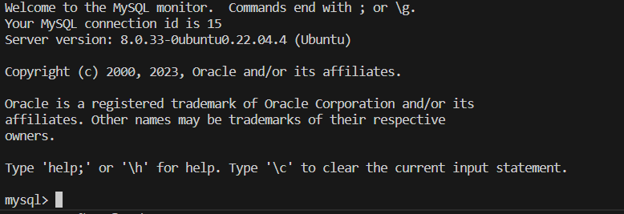

# TOPIC:  IMPLEMENTING A CLIENT SERVER ARCHITECTURE USING MYSQL DATABASE MANAGEMENT SYSTEM (DBMS).

## Objective: To Establish connectivity to a SQL server and Client instance 

# Project Flow

I created two EC2 instances named **mysql_server and mysql_client**

on both instance, the command below  was ran to update the repo

|`sudo apt update`

The command below was ran to install mysql server agent

`sudo apt-get install mysql-server`

After successfull installation, the sql service was started with the command below

`sudo systemctl start mysql`

>**output**

On the sql client instance, the command below was used to install mysql client 

    `sudo apt-get install mysql-client`

To confirm if the mysql-client was succesfully installed, the command below was used

     `mysql --version` 

>**output** 

To enable connectivity to the sql-client, a new inbound rule was set on the mysql server. 

- Type of inbound rule - mysql/Aurora 
- The source IP was sent to the Ip of the client Ip with was obtained by ip addr on the client instance 

**output**

Next step was to allow the mysql-server instance to allow connection from the remote instance(client instance)

This was done by changing the bind address on the mysqld.cnf to 0.0.0.0

The command below was used 

`sudo vi /etc/mysql/mysql.conf.d/mysqld.cnf`

**output** 

The next step is to create a datebase that will later be access via the client instance. 

For this step, the following steps were used

- Create a user on the sql server
- Create a table 
- Grant the created user in step 1 access to the created database

To create, the command below was used to change the instance to sql mode
`sudo mysql`

>**output**
  
To create a user, the command below was ran

`CREATE USER 'example'@'%' IDENTIFIED BY 'password';`

To create a datebase, the command below was used

`CREATE DATABASE BUKAYO_SAKA`

To grant access to the created user, the command below was ran

`GRANT ALL PRIVILEGES ON example_db.* TO 'username'@'%' IDENTIFIED BY 'password';`

To input gg

        

